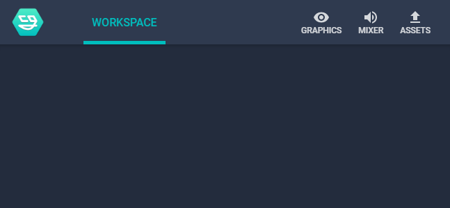

Getting started with NodeCG can be overwhelming.
Here's my own quick guide to doing NodeCG stuff.

Questions, comments and changes are encouraged via GitHub issues and pull requests.

## layout of this guide
{:.no_toc}
* TOC
{:toc}


# let's get set up!

## development environment
* windows 10 x64
* [visual studio code](https://code.visualstudio.com)
* [git for windows cli](https://git-scm.com/downloads) - add it to PATH when it asks
* [nodejs runtime](https://nodejs.org) latest version
* [yarn](https://yarnpkg.com), using the .msi installer

Visual Studio Code is a great, free, lightweight IDE inspired by the likes of Sublime and Atom.
Git is a version control system - NodeCG depends on git, and we'll use it too.
NodeJS is a server that runs Javascript code.
Yarn is a Javascript package manager, an alternative to the `npm` package manager that ships with NodeJS.

## NodeCG
Open a console window, we've got work to do.

```console
$ yarn global add bower
...
success Installed "bower@..." with binaries:
      - bower
Done in 12.34s.

$ yarn global add nodecg-cli
...
success Installed "nodecg-cli@5.0.1" with binaries:
      - nodecg
Done in 13.46s.

$ mkdir nodecg && cd nodecg
D:\nodecg

$ nodecg setup
Finding latest release... done!
Cloning NodeCG... done!
Checking out version v1.1.2... done!
Installing production npm dependencies... done!
Installing production bower dependencies... done!
NodeCG (v1.1.2) installed to D:\nodecg

$ nodecg start
[nodecg] No config found, using defaults.
info: [nodecg/lib/server] Starting NodeCG 1.1.2 (Running on Node.js v9.11.1)
info: [nodecg/lib/server] NodeCG running on http://localhost:9090
```

Go to <http://localhost:9090> and be proud.
Your brand new NodeCG looks like this:



Let's stop NodeCG now.
Go to the console and press `Ctrl+C` a few times.
This kills the NodeCG.


# now we code

## our first bundle
We need a folder for our bundle, and a `package.json` for it.

```console
$ cd bundles
D:\nodecg\bundles

$ mkdir toys && cd toys
D:\nodecg\bundles\toys

$ yarn init --yes
warning The yes flag has been set. This will automatically answer yes to all questions.
success Saved package.json
Done in 0.11s.
```

Now we add a `nodecg` section to `package.json`.
NodeCG looks at `compatibleRange` to see if it can run the bundle.
`^1.0.0` allows everything from `1.0.0` onwards...
but rejects everything from `2.0.0` onwards.
We would change this if we depend on a new feature in `1.1.0`.

```json
{
  "name": "toys",
  "version": "1.0.0",
  "main": "index.js",
  "license": "MIT",
  "nodecg": {
    "compatibleRange": "^1.0.0"
  }
}
```

## our first graphic
Add a `nodecg.graphics` section to our bundle's `package.json`.
The `width` and `height` aren't strict, so don't worry.

```json
"nodecg": {
  "compatibleRange": "^1.0.0",
  "graphics": [
    {
      "file": "first.html",
      "width": 1920,
      "height": 1080
    }
  ]
}
```

We need to make `first.html` - it goes in the `graphics` folder of our bundle.

```html
<!DOCTYPE html>

<h1>My First Graphic</h1>
<div id="value"></div>

<style>
</style>

<script>
  element = document.getElementById('value')
  replicant = nodecg.Replicant('first')
  
  replicant.on('change', newValue => {
    element.innerText = newValue
  })
</script>
```

## our first dashboard panel
Add a `nodecg.dashboardPanels` section to our bundle's `package.json`:

```json
"nodecg": {
  "dashboardPanels": [
    {
      "name": "first",
      "title": "My First Panel",
      "width": 4,
      "headerColor": "#ff9900",
      "file": "first.html"
    }
  ]
}
```

```html
<!DOCTYPE html>

<h1>My First Panel</h1>

<style>
</style>

<script>
</script>
```

## our first extension
This time we don't need to edit our `package.json`!
Just create an `extension` folder with `index.js` inside.

```js
module.exports = nodecg => {
}
```
